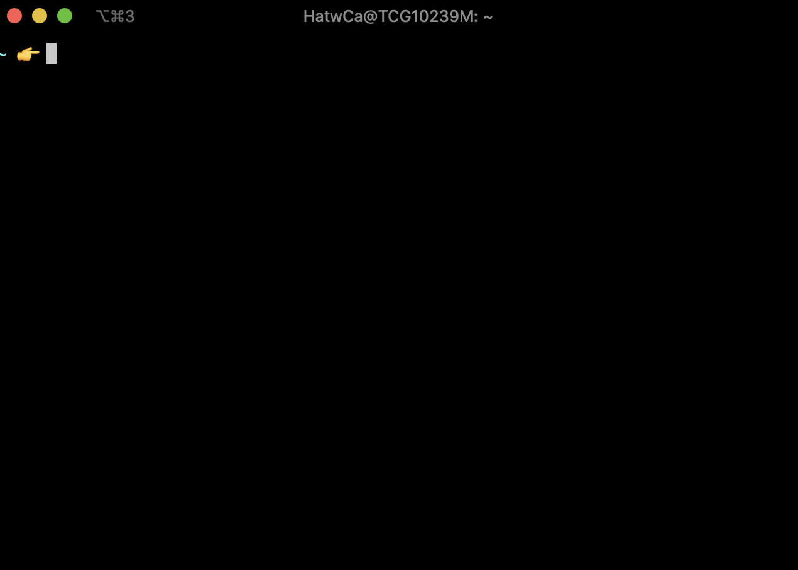

if you've been learning to code using some kind of brower-based tool, like codecademy, awesome! i hope you've been enjoying it! and now you're ready to take the next steps into coding. maybe you are thinking about getting reading to apply for a coding job, or you'd like to create a website or other project. even better! so, you might be wondering how what you've been doing relates to day to day software development work, or how the bits of code you've been learning all fit together to make an app or site. well, one thing you will need is get an environemt set up to work it, so you can write, run and deploy code to show off to the world.

so what do i mean by an environment?
i mean the setting for you to write and run your code on your computer. you'll write your code in a text editor, and execute it using your terminal.

terminal
what's a terminal??
it's this thing. .  
it's also know as a console, a shell, a command line. i assume these all have slightly different nuances of meaning, but people use them interchangeably. the terminal is another way of interacting with your comuputer. usually, you interact with the computer via the GUI (graphical user interface) of your operating system. the terminal (oh yeah people also call it a CLI - command line interface) is another way into the functionality of your machine. you can do all the stuff you'd normally do with your computer like open and edit files, move them around, rename them and run them.  
a really really important part of of the early stages of learning to program is learning not to be afraid of your terminal. yeah, initally it feels like you're hacking into the matrix (this feeling doesn't really go away) or like you might break something, but it's pretty unlikely you will (it's not impossible though).  
how to get started with being more familiar with your terminal? i'd start with this tutorial [https://www.vikingcodeschool.com/web-development-basics/a-command-line-crash-course], or this interactive tutorial. open the application called Terminal on your computer, and have some fun.

text editor - vs code
so, you've been writing code in your browser. that's great! now we're going to write code in a program on your machine, known as a text editor. it's a fancy name for a program in which you essentially edit and save files.  
there are lots of different programs people use to do this. you might have heard of Vim, or Atom, or Visual Studio. Heck, you could write your code in a Word document, but it might slow you down.  
I'm going to talk about a program called VS Code, which I use, and I think is a good program for novices and more experienced programmers. Oh! A name people also use for this type of program is an IDE or Integrated Development Environment. VS Code isn't an IDE, but's another thing where people use two terms with slightly different meanings interchangeably. Don't worry about it right now.
Here's a screenshot of my VS Code window while I write this post.

git / github
read this [https://www.freecodecamp.org/news/learn-the-basics-of-git-in-under-10-minutes-da548267cc91/] or this [https://guides.github.com/introduction/git-handbook/] or check out these resources [https://try.github.io/]
version control software is essential for keeping track of your code, and git is what most people use.

why should i care?
